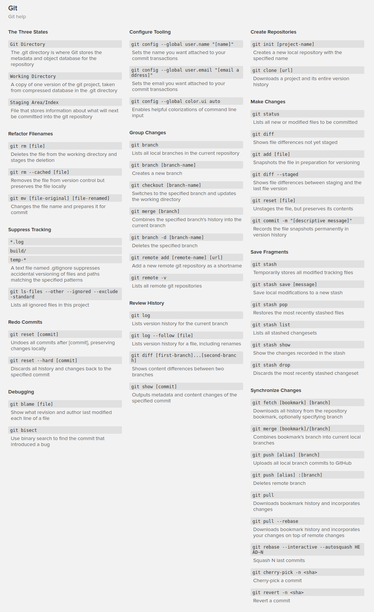

Useful Commands
===============

## NPM commands

` npm list -g --depth=0 ` - show list of npm packages installed globally.

----------

## Linux (Debian) commands

#### Install from Source Code

` tar xf [archive_name] ` - unpack archive

` ./configute `

` make `

` [sudo] make install `

#### Turn On/Off Firewall
` sudo ufw enable ` - enable firewall

` sudo ufw disable ` - disable firewall

` sudo ufw status verbose ` - check status

` sudo ufw show raw ` - show more rules

----------

## Git Commands

